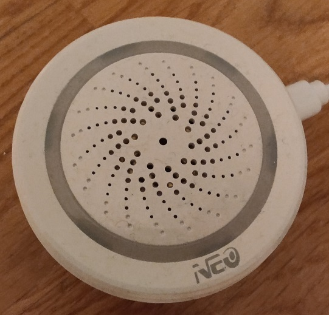
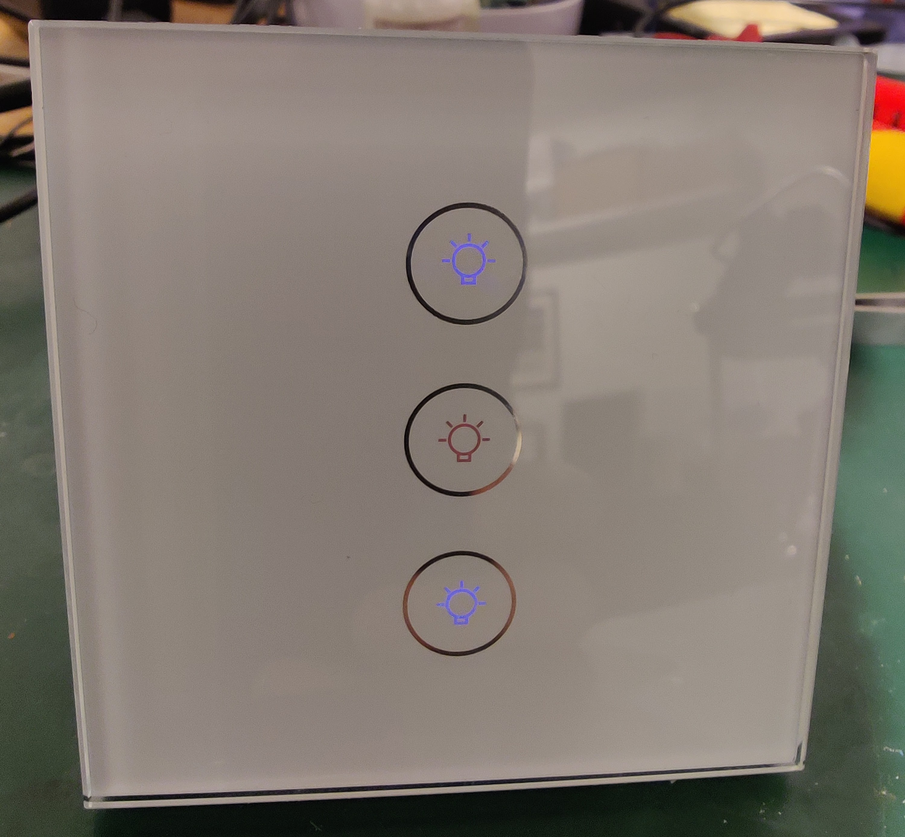

# tuya Wifi Hubitat device Drivers

This integration utilizes an API tuya devices exposes on the local network, i.e. not via the tuya servers, to control and read status from devices. This driver supports both 3.1 and 3.3 version of the protocol, more on that later.

All tuya devices are communicating over the network using AES ECB encryption. The key used for encrypt and decrypt is created as part of pairing the device with a tuya smart app (SmartLife, Jinvoo Smart, etc.), we need to get this key in order to use the Hubitat device driver.

***

## How to get the Hubitat tuya integration working?

You need to get the device id, device key, device local ip-address, and device endpoints by following an excellent guide found here: https://github.com/jasonacox/tinytuya#tinytuya

> Be aware that every time you pair a device to a smart app a new local key is generated, and hence must be updated!

### Quick summary
1. Install python (https://www.python.org/)
2. Install the TinyTuya module (https://github.com/jasonacox/tinytuya#tinytuya-setup)
3. Using your phone, pair all devices you want to use in Hubitat using one of the tuya smart apps (SmartLife, Jinvoo Smart, etc.). Refer to the device user guide on how to pair the device.
4. Scan you network for tuya devices by writing the following in command line ```python -m tinytuya scan```
5. Create an account and log on to iot.tuya.com and connect your tuya smart app to this account see step 3 here: https://github.com/jasonacox/tinytuya#setup-wizard---getting-local-keys
6. Run the tinytuya wizard, step 4 here: https://github.com/jasonacox/tinytuya#setup-wizard---getting-local-keys
7. Now you should have full overview of everything you need to get the Hubitat device driver working
8. Add the device driver from https://raw.githubusercontent.com/ivarho/hubitatappndevice/master/Device/tuyaDevices/tuyaGenericDevice.groovy to Hubitat
9. In Hubitat, open "Devices", then click "Add Device", and "</>Virtual".
10. Give the device a Device Name" and select the Type: "tuya Generic Device", and click "Save Device"
11. Now, add the "Device IP", "Device ID", "Device local Key" and select the tuya protocol version that you got from point 6.
12. Lastly set the Endpoint you want to control. During step 6 you should see something called "Status" together with each device, something like this: ```Status: {'1': False, '2': False, '3': False, '5': 0}```, the endpoints are the numbers in front of the ```False```. This status block is for a "Three gang switch", where each number corresponds to a button on the switch. Endpoint 5 control all buttons on/off. More on endpoints under the Wifi Siren section
13. Click "Save Preferences"
14. You should now be able to control your tuya device via Hubitat on local network only.

You should also consider "locking" the device IP on your (wifi)router so that it does not change ip-address, then the Hubitat integration won't be able to find the device. Next thing to do is to modify the generic driver to something more suitable to your exact device (see my wifi Siren implementation as example).

***

## Some notes and experiences

I have seen tuya protocols being version 3.1 (my first device), and 3.3 my second tuya device after being asked about doing a firmware update when pairing it to one of the tuya apps. Both protocols work by you sending a command and the device responding back with the result of that command. Here are the main differences.

### Version 3.1 Protocol
Version 3.1 is a somewhat complicated implementation of the protocol. When creating the encrypted message to send to the device there is a lot of steps involved, e.g. m5sum of the entire message is embedded into the message itself. And some of the data is base64 encoded, and some not, so it is a bit challenging to encode and decode. The nice thing however is that it sends status messages in clear text so it is easier to poke the device to verify that it is alive (v 3.3 of the protocol encrypts everything). Controlling the device require the message to be encrypted, and the device also answer encrypted. However, requesting status, the messages comes through as clear text.

### Version 3.3 Protocol
Version 3.3 of the tuya protocol is somewhat cleaner, everything is encrypted in both directions. Hence, you have to have a correct key to be able to see any readable data from the device. They have removed all the md5sum, base64 encoding etc. which makes for a simpler implementation.

Here is an example of data coming from the device:
```
000055AA00000000000000 07 000000 87 332E33 000000000000000000000000 B36A6A20ABFA7...228B 4B593276 0000AA55
````
- Message prefix same for all: ```000055AA00000000000000```
- Message command (0A = "status", 07 = "set"...): ```07 = "set"```
- 6 x zero: ```000000```
- Protocol version (in "clear" text): ```332E33 = "3.3"```
- Encrypted payload: ```B36A6A20ABFA7...228B = {"devId":"02...d1","dps":{"1":false},"t":1643297709}```
- CRC32: ```4B593276```
- Postfix: ```0000AA55```

> As far as I can see "set"  message replies contains the version "field" however, "status" messages does not, so I do not have a more elegant way of determining the version on the "status" messages other than clear text meaning 3.1, and encrypted meaning 3.3.

***

## tuya Wifi Siren

I have one of these Wifi Sirens that got me into this Hubitat-tuya integration. Here is a few words on how I communicate with the siren.



When I do the ```python -m tinytuya wizard``` or ```python -m tinytuya scan``` command as described above, my siren replies the following status message:
```
Status: {'101': '4', '102': '3', '103': 15, '104': False}
```
I.e. it has 4 endpoints, and I have found the following meaning for these:
- 101 = unknown
- 102 = Siren sound 0-10
- 103 = Siren length (s), how long should the siren sound when turned on in seconds
- 104 = Siren on/off (true/false)

### Siren type

Under is a list of my interpretation of the different sounds on the siren (mostly for my own documentation)

1. "Car alarm"
2. "Tornado warning...?"
3. "Wiiiiuuuu wiiiuuuu"
4. "Door bell"
5. "Police siren?"
6. "Bell"
7. "Burglar alarm gone mad...?"
8. "American fire truck horn"
9. "Production line down"
10. "Burglar alarm" (more conventional)

## tuya Three gang switch

Way back, before getting into all this smart home things, I bought several of these 3 button touch light switches thinking they were something else. Back then I did not get them to work, and they did not really fit the need, so I just put them on the shelf. The other day I stumbled across them, and found out I had to give them some investigation, and behold, they turn out to be tuya devices. They look something like this:


They are totally unbranded, the build quality seems ok, but I do not intend to use them for anything permanent. They are not even CE marked as far as I can see, and hence also illegal to install, in Norway at least.

><b>Disclaimer:</b> I have no experience with these devices other than debug purposes, and I come with no recommendations either way.

Anyway, it turns out that the device works flawlessly with the tuya driver, hence for the fun of it I implemented a full driver for these devices. Perhaps it is a good example for anyone in need to develop the tuya drivers into actual devices to add to the smart home.

### tuyaThreeGangSwitch driver features:
- tuya encrypted protocol for local communication
- Parent device spawning 3 child devices upon installation
- Configurable status polling, parent updates children as needed
- Parent control child settings
### Endpoints
Switch status report:
```
{'1': true/false, '2': true/false, '3': true/false, '5': 0}
```
Endpoints 1-3 corresponds to top, middle and bottom touch buttons on the physical deice. Endpoint 5 is a master controller that turns all 1-3 enpoints on or off (true or false). In my implementation the parent device controls endpoint 5, i.e. all switches on or off. While each child device corresponds to a physical button.
